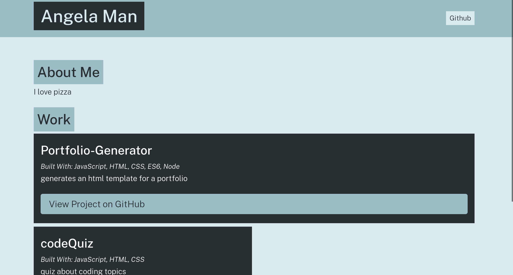

# Portfolio-Generator

## Purpose
An application that creates an HTML portfolio page by capturing user input via the command line

## Made With
* JavaScript
* Node.js
* CSS
* HTML

## Snapshot

## Screen Recording

## Instructions
* Clone Portfolio-Generator repository
* Open Bash Terminal
* Run command: npm install
* Enter "node app" in command line
* Answer prompts about user info and projects to display in the portfolio
* Open newly created index.html to view the generated portfolio

## Contribution
Made by Angela Man